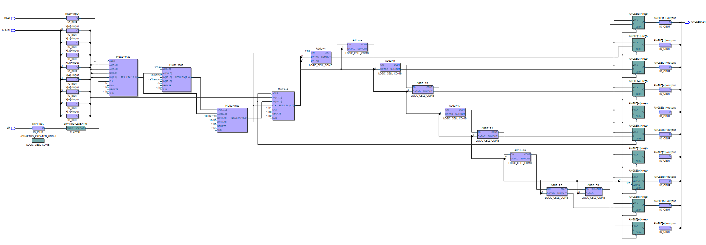
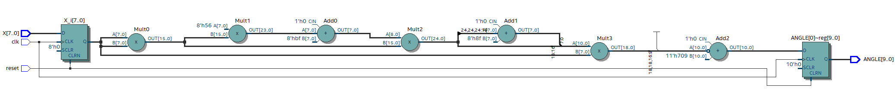
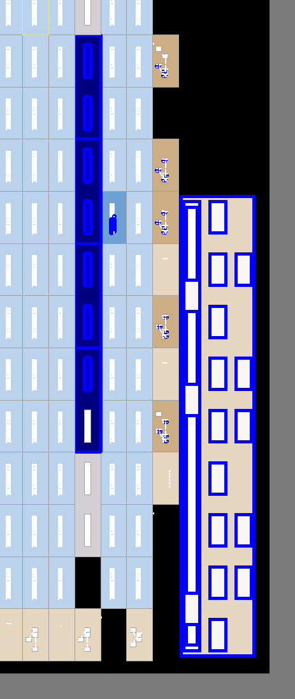
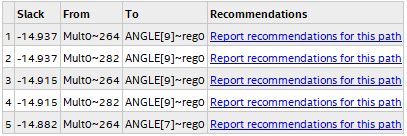
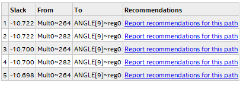

# Generated Design
## Netlist post-fitting
  

## RTL
  

## On-Chip layout
  

# Utilization g60_arccos
 - Logic utilization (in ALMs): 6/32,070 (< 1%)
 - Total registers: 10  
 - Total pins: 20/457 (4%)
 - Total DSP blocks: 4/87 (5%)

# Timing Analysis
All slack values are end point total slack times.

## Requested Fmax = 250 MHz | T_ck = 4 ns   
  - Fast 1100 mV 0C  Model **Hold slack** = +0.896 ns  
  - Slow 1100 mV 85C Model **Setup slack** = -13.537 ns  
  - Slow 1100 mV 85C Model **End Points TNS** = -146.375 ns  
  - Slow 1100 mV 85C Model **Fmax** = 57.02 MHz  

## Requested Fmax = 125 MHz | T_ck = 8 ns  
  - Fast 1100 mV 0C  Model **Hold slack** = +0.898 ns  
  - Slow 1100 mV 85C Model **Setup slack** = -9.130 ns  
  - Slow 1100 mV 85C Model **End Points TNS** = -106.802 ns  
  - Slow 1100 mV 85C Model **Fmax** = 58.38 MHz

## Requested Fmax = 50 MHz | T_ck = 20 ns
  - Fast 1100 mV 0C  Model **Hold slack** = +0.820 ns    
  - Slow 1100 mV 85C Model **Setup slack** = +2.050 ns  
  - Slow 1100 mV 85C Model **Fmax** = 55.71 MHz
